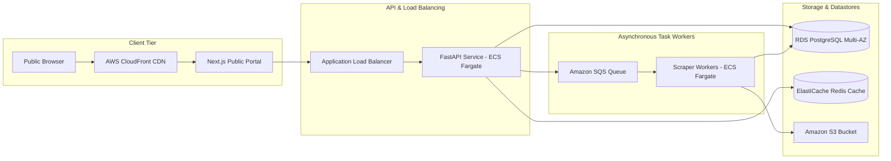
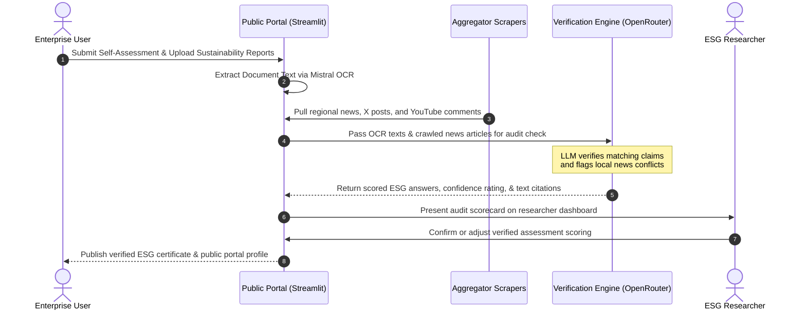

# Indonesia News & Social-Media Monitoring Workspace

A comprehensive multi-application workspace for Indonesian news aggregation, social-media monitoring (Instagram, X/Twitter, YouTube), OCR document processing, and ESG (Environmental, Social, and Governance) assessment scoring.

```mermaid
graph TD
    subgraph Data Sources
        BI_API[Berita Indo News API]
        X_DATA[X / Twitter API & Playwright Scrapers]
        YT_DATA[YouTube Data API v3]
    end

    subgraph Processing & Resolution (extractor/)
        PR[Pipeline & Redirect Resolver]
        AE[Article Extractor - Trafilatura/Newspaper3k]
    end

    subgraph Local Storage (data/)
        JSON_DB[(JSON Article & Social Datasets)]
        LOG_DB[(JSONL Operational Logs)]
    end

    subgraph Web Interfaces (Streamlit)
        RootApp[Root Monitor - app.py]
        ResearchApp[Research Workflow - new_app/app.py]
        PublicApp[Public ESG Portal - public_account/app.py]
    end

    BI_API --> PR
    PR --> AE
    AE --> JSON_DB
    X_DATA --> JSON_DB
    YT_DATA --> JSON_DB
    
    JSON_DB --> RootApp
    JSON_DB --> ResearchApp
    JSON_DB --> PublicApp
    LOG_DB <--> RootApp
```

---

## 1. Project Overview

This project is a multi-purpose scraping, analysis, and verification platform tailored for Indonesian news and social-media monitoring. It solves two primary challenges:
1. **Dispersed Monitoring**: Pulls Indonesian articles and social media updates into a unified dashboard, resolving Google News redirects and extracting clean, raw body text for semantic analysis.
2. **ESG (Environmental, Social, Governance) Assessment & Research**: Combines document OCR ingestion with LLM-backed verification engines to score and report ESG compliance.

The codebase is divided into three separate Streamlit applications that cater to different user groups (system operators, researchers, and public enterprises).

---

## 2. Tech Stack

The workspace leverages a modern Python web scraping and UI stack:

* **Core Platform & UI**: [Streamlit](https://streamlit.io/) (Data app framework), [Pandas](https://pandas.pydata.org/) (Data manipulation), [Plotly](https://plotly.com/) & [Altair](https://altair-viz.github.io/) (Data visualization).
* **Ingestion & Scraping**:
  * **News Extraction**: [Newspaper3k](https://newspaper.readthedocs.io/), [Trafilatura](https://trafilatura.readthedocs.io/) (HTML parsing and extraction).
  * **Social Media Ingestion**: [Playwright](https://playwright.dev/python/) (Headless browser automation), [Instaloader](https://instaloader.github.io/) (Instagram metadata), `requests` (REST APIs).
* **Intelligence & Utilities**:
  * **LLM Engine**: [OpenRouter API](https://openrouter.ai/) (supporting multiple LLM vendors for ESG verification and chat interactions).
  * **OCR Ingestion**: [Mistral API](https://mistral.ai/) (for bulk OCR on uploaded PDFs and image formats).
* **Utilities**: `BeautifulSoup4` (HTML parsing fallback), `python-dotenv` (Configuration).

---

## 3. Architecture Overview

The system operates as a file-based data pipeline composed of four major components:

1. **Ingestors (`ingestors/`, `scrapers/`)**: Contains scrapers and REST API callers for Instagram, YouTube, and X. Uses headless Playwright scrolling for client-side content rendering where API keys are unavailable.
2. **Extractor (`extractor/`)**:
   * Resolves obfuscated Google News links using a recursive BeautifulSoup redirect-parser.
   * Downloads, strips page noise (headers, ads), and writes raw HTML along with extracted clean text into structured JSON.
3. **Storage (`data/`, `public_account/user_data/`)**: Relies on structured, lightweight JSON arrays for article datasets and line-delimited JSON (`.jsonl`) files for logs, making deployment zero-infrastructure.
4. **Active Frontends**:
   * **Root App (`app.py`)**: System operator control panel to configure scheduled runs (automated client-side 6h refreshes), view ingestion trends, and check system logs.
   * **Alternative Scraper (`app_2.py`)**: Resumable standalone scraping tool for custom single URLs or bulk CSV lists.
   * **Research Workflow (`new_app/app.py`)**: Scientific workspace supporting OCR runs, ESG MCQ verification tables, semantic chatbot, and report generators.
   * **Public Portal (`public_account/app.py`)**: Secured customer interface facilitating company register profiles, document uploads, and self-assessment surveys.

---

## 4. Installation & Setup

Follow these steps to run the applications locally on your machine:

### Prerequisites
* Python 3.10, 3.11, or 3.12 installed.
* Node.js / NPM (if running browser-based scrapers or specific frontends).

### Step-by-Step Installation

1. **Clone the Repository**:
   ```bash
   git clone <repository_url>
   cd news_aggregator
   ```

2. **Set up a Virtual Environment**:
   ```bash
   python3 -m venv venv
   source venv/bin/activate  # On Windows, use: venv\Scripts\activate
   ```

3. **Install Dependencies**:
   ```bash
   pip install --upgrade pip
   pip install -r requirements.txt
   ```

4. **Install Playwright Browsers**:
   ```bash
   playwright install chromium
   ```

5. **Configure Environment Variables**:
   Copy or create your `.env` file in the project root folder (see the [Environment Variables](#7-environment-variables) section below).

6. **Verify Installation**:
   Ensure python compile checks pass without syntax errors:
   ```bash
   find . -type f -name "*.py" -exec python3 -m py_compile {} +
   ```

---

## 5. Usage Guide

### Running the Applications
Start any of the entry points from the root workspace folder:

* **To run the main monitoring interface**:
  ```bash
  streamlit run app.py
  ```
* **To run the Standalone Scraper**:
  ```bash
  streamlit run app_2.py
  ```
* **To run the Research Workflows (OCR / Verification)**:
  ```bash
  streamlit run new_app/app.py
  ```
* **To run the Public Portal**:
  ```bash
  streamlit run public_account/app.py
  ```

### Usage Examples

#### Bulk Article Scraping (in `app_2.py`)
1. Open the UI and select the **📂 Bulk Scraping** tab.
2. Select **Paste URL list** or **Upload CSV** (ensure the CSV contains a column header named `url`).
3. Click **🚀 Start Bulk Scraping**.
4. The system will incrementally scrape in batches of 50, checking against pre-existing files in `data/articles/` to avoid redundant requests.

#### Generating Daily Logs and Reports (in `app.py`)
1. Click **Fetch All Configured Sources** to aggregate news from 13 Indonesian media outlets.
2. Under **Daily summary**, check **Enable Email delivery** or **Enable Slack webhook**.
3. Click **Generate daily summary now** to export daily data as a JSON file, automatically emailing the file or pushing alerts to your team Slack.

---

## 6. API Reference

### Internal Fetching Endpoints
The platform queries the Indonesian news aggregator API at `https://berita-indo-api-next.vercel.app` dynamically:

* **CNN News**: `/api/cnn-news/[category]` (Categories: `nasional`, `internasional`, `ekonomi`, `olahraga`, `teknologi`, `hiburan`, `gaya-hidup`)
* **CNBC News**: `/api/cnbc-news/[category]` (Categories: `market`, `news`, `entrepreneur`, `syariah`, `tech`, `lifestyle`)
* **Republika News**: `/api/republika-news/[category]` (Categories: `news`, `nusantara`, `khazanah`, `islam-digest`, `internasional`, `ekonomi`, `sepakbola`, `leisure`)
* **Tempo News**: `/api/tempo-news/[category]` (Categories: `nasional`, `bisnis`, `metro`, `dunia`, `bola`, `sport`, `cantik`, `tekno`, `otomotif`, `nusantara`)
* **Antara News**: `/api/antara-news/[category]` (Categories: `terkini`, `politik`, `hukum`, `ekonomi`, `metro`, `olahraga`, `humaniora`, `lifestyle`, `dunia`, `tekno`)
* **Okezone News**: `/api/okezone-news/[category]` (Categories: `breaking`, `sport`, `economy`, `lifestyle`, `celebrity`, `bola`, `techno`)
* **BBC News**: `/api/bbc-news/[category]` (Categories: `dunia`, `berita_indonesia`, `olahraga`, `majalah`, `multimedia`)
* **Tribun News**: `/api/tribun-news/[category]` (Categories: `bisnis`, `superskor`, `sport`, `seleb`, `lifestyle`, `travel`, `otomotif`, `techno`)

### Code Ingestion Signatures
For automation, Python developer modules can import these functions directly:

* **`fetch_user_tweets(username, max_results=10, source_type="official")`**  
  * *Location*: `ingestors.x_api_ingestor`
  * *Input*: X username (str), limit size (int), source classification (str).
  * *Output*: List of dicts containing tweet metadata, metrics (likes, retweets), and text body.

* **`fetch_channel_videos(channel_id, max_results=25)`**  
  * *Location*: `ingestors.youtube_api_ingestor`
  * *Input*: YouTube Channel ID (str), maximum results to fetch (int).
  * *Output*: Bounded list of videos with title, description, and publication dates.

* **`get_channel_id_from_url(url)`**  
  * *Location*: `utils.youtube_utils`
  * *Input*: YouTube handle, URL pattern, custom name or raw ID (str).
  * *Output*: Valid resolved YouTube channel ID (UC...) or `None`.

---

## 7. Environment Variables

Create a file named `.env` in the root project folder to specify credentials:

| Variable | Required For | Purpose / Value |
| --- | --- | --- |
| `MISTRAL_API_KEY` | Research OCR | Key for Mistral AI bulk OCR ingestion of PDF documents. |
| `OPENROUTER_API_KEY` | Chatbots / ESG Verification | Key to access OpenRouter LLM APIs for interactive chat. |
| `YOUTUBE_API_KEY` | YouTube Scrapers | Google Cloud Console Developer Key for YouTube Data API v3. |
| `X_BEARER_TOKEN` | Official X API | Bearer Token for Twitter Developer API (V2 endpoints). |
| `OPENROUTER_API_URL` | LLM Custom Overrides | *(Optional)* Endpoint override URL for OpenRouter. |
| `OPENROUTER_MODELS_URL` | LLM Custom Overrides | *(Optional)* Endpoint override URL for listing models. |

---

## 8. Contributing Guide

1. **Branching Rules**: Avoid working directly on `main`. Create descriptive branches such as `feature/social-scrapers` or `bugfix/redirect-resolution`.
2. **Comment Code**: Maintain docstrings. Add detailed inline explanations for any complex Web scraping, DOM extraction, or regex logic.
3. **Validate Code Compilation**: Before committing, verify code parsing checks:
   ```bash
   find . -type f -name "*.py" -exec python3 -m py_compile {} +
   ```
4. **PR Checklists**: Ensure your changes do not introduce duplicate implementations. Clean up or comment out unused variables and test files prior to code review submission.

---

## 9. License

This project is licensed under the **MIT License**. You are free to modify, distribute, and execute the codebase for personal, scientific, or commercial purposes. See the accompanying LICENSE file for details.

---

## 10. Scaling Guide: From MVP to Production-Grade

This section details how to scale the application from its current zero-infrastructure, file-based prototype to a robust, enterprise-grade architecture.

### 1. Current Bottlenecks (What will break first under load?)
* **Concurrent File Writing (`data/*.json`, `logs.jsonl`)**: Multiple concurrent scrape tasks or web requests will result in write collisions, locking issues, or file corruptions because Python's standard file descriptors lack locking protocols.
* **Synchronous Web Scraping in Streamlit Threads**: Running Playwright browsers or Newspaper3k fetches synchronously inside Streamlit request sessions blocks render threads. A single slow target site can cause timeouts or OOMs for other users.
* **Serverless Container Memory Overhead**: Streamlit keeps user states in memory and reruns files from top to bottom on interaction. Massive PDF uploads for bulk OCR will instantly spike RAM and trigger container OOM crashes.
* **IP and Request Rate Limiting**: Fetching social metrics without proxies or session rotations causes platforms like X or YouTube to throttle or block IP addresses.

### 2. Database Scaling
* **Transition to Relation Database (RDBMS)**: Migrate all JSON and JSONL stores to a managed SQL database like **AWS RDS PostgreSQL**. Define critical indexes on:
  * `article(url)` and `article(published_at)`
  * `social_post(post_id, platform)`
* **In-Memory Caching (Redis)**: Introduce **AWS ElastiCache Redis** to cache analytical aggregates (e.g. daily dashboards, news lists) with a 15-minute TTL to reduce database query load.
* **Read Replicas**: Separate writes (heavy ingestion scraper processes) from reads (interactive dashboards). Direct analytical queries to database Read Replicas.
* **Horizontal Partitioning**: Partition tables like `article` and `social_post` by month (`published_at`) to optimize queries on historical timelines.

### 3. Backend Scaling
* **Asynchronous Task Architecture**: Extract scraping loops from web threads. Implement **Celery** with **RabbitMQ** or **Redis** as a task queue broker to handle background extractions.
* **API Gateway Service**: Decouple the scrapers and databases behind a fast asynchronous API layer (e.g. **FastAPI**) to manage authentication, endpoints, and uploads.
* **Horizontal Auto-Scaling**: Containerize FastAPI and Celery workers with Docker. Run on **AWS ECS Fargate** or **AWS EKS (Kubernetes)** behind an **Application Load Balancer (ALB)**. Scale workers dynamically based on the queue length (SQS messages).

### 4. Frontend Scaling
* **Decouple Streamlit from Public Portal**: Keep Streamlit solely as an internal operator's dashboard. Rebuild customer-facing views (`public_account/`) using a standard framework like **Next.js** to handle user portals.
* **CDN (Content Delivery Network)**: Serve Next.js static layouts and uploaded documents using **AWS CloudFront** with **Amazon S3** as the origin backing store.
* **SSR/SSG & ISR**: Use Static Site Generation (SSG) for corporate directories and public pages. Implement Incremental Static Regeneration (ISR) to rebuild landing metrics hourly. Use Server-Side Rendering (SSR) exclusively for private user profile consoles.

### 5. Recommended Cloud Infrastructure (AWS)
* **Compute Services**: AWS ECS Fargate for running serverless containers (API instances and background scraper workers).
* **Database & Cache**: AWS RDS PostgreSQL Multi-AZ (highly available transactions) + AWS ElastiCache Redis.
* **Storage**: Amazon S3 (for PDF documents, raw HTML archives, and generated reports).
* **Traffic Control**: AWS ALB for backend routing + AWS CloudFront (CDN) for asset caching.
* **Queuing**: Amazon SQS for managing scrape tasks.



### 6. Cost Estimates

| Scale | Active Users | Target Architecture | Key Cloud Services | Estimated Cost (Monthly) |
| --- | --- | --- | --- | --- |
| **MVP** | 1,000 / mo | Single-server / Container | 1x ECS Fargate task (0.5 vCPU, 1GB RAM), RDS PostgreSQL db.t4g.micro | **$50 - $100** |
| **Growth** | 10,000 / mo | Decoupled Multi-Container | 2-4 ECS Fargate Tasks, RDS PostgreSQL db.t3.medium (Multi-AZ), ElastiCache Redis, S3 + CloudFront CDN | **$300 - $600** |
| **Enterprise** | 100,000 / mo | Microservices + Distributed Workers | Next.js on Vercel/CDN, 10-20 ECS workers, RDS db.m6g.xlarge (1x Write, 2x Read Replicas), Redis Cluster, API proxy rotation services | **$2,500 - $5,000** |

### 7. Step-by-Step Roadmap
1. **Phase 1: DB Migration & Logging Extract (Months 1-3)**: Replace local JSON data structures with RDS PostgreSQL. Migrate standard app logs from `logs.jsonl` to database tables or cloud aggregators (AWS CloudWatch).
2. **Phase 2: Task Queue Integration (Months 3-6)**: Decouple scraping triggers. Deploy celery workers to fetch articles, resolve redirects, and run Playwright in background loops.
3. **Phase 3: Next.js Re-Architecting (Months 6-9)**: Move the customer portal (`public_account/`) to Next.js. Cache frontend landing data on CloudFront and restrict Streamlit usage to internal administrator dashboards.
4. **Phase 4: High Availability Clustering (Months 9-12)**: Enable database read replication, set up proxy rotation modules for social scrapers, configure auto-scaling triggers, and establish strict staging/production pipelines.

---

## 11. Competitive Analysis & Market Positioning

This section maps out the competitive landscape, analyzing global and regional monitoring/ratings tools to contextualize how this platform can differentiate itself.

### 1. Competitor Analysis Table

| Company / Platform | Scope & What They Do | Tech Stack (Est.) | Business Model | Scale | Key Success Drivers |
| --- | --- | --- | --- | --- | --- |
| **Meltwater** | Global media intelligence, news monitoring, and social listening. | Java, Python, React, Elasticsearch | Enterprise SaaS Subscriptions | Enterprise (Global) | Comprehensive database of historical global news outlets and social APIs. |
| **Brandwatch** | Social media listening, consumer analytics, and sentiment mapping. | Java, Node.js, React, PostgreSQL | Enterprise SaaS Subscriptions | Enterprise (Global) | Highly sophisticated NLP pipelines, custom classifiers, and visual/logo monitoring. |
| **Talkwalker** | Real-time social listening, campaign tracking, and video recognition. | Java, Python, Elasticsearch, Redis | SaaS Subscriptions | Enterprise (Global) | Real-time audio and video OCR scanning capabilities inside media feeds. |
| **Ecovadis** | Structured sustainability evaluations and scorecards for supply chain vendors. | .NET, Angular, SQL Server | Annual Subscriptions based on company size | Global (Mid-to-Large corporate networks) | Standardized verification frameworks matching human audit reviews with uploaded PDF proof. |
| **RepRisk** | Systematic daily monitoring of ESG risk exposure and negative news screening. | Python, Scala, Elasticsearch, Postgres | Custom institutional subscription fees | Global (Financial & investment banks) | Proprietary daily risk indexing algorithm focusing entirely on negative incidents. |
| **Sustainalytics** | Institutional ESG research, corporate ratings, and investor indexes. | Java, Angular, Microsoft SQL | Data Licensing Agreements | Global (Investment firms) | Industry-recognized rating benchmarks used by global stock exchanges. |
| **MSCI ESG Research** | Financial-grade ESG rating scorecards and investment index mapping. | Java, C#, Oracle | Data Licensing & Custom Reports | Global (Asset Managers) | Direct tie-ins with major index funds, acting as a global financial market standard. |
| **Kazee (Indonesia)** | Local Indonesian media tracking, public opinion mapping, and sentiment tracking. | PHP, Python, React, MySQL | SaaS & Retainers | National (Indonesia - Govt & Corporates) | Deep localized colloquial dictionaries (slang, regional Indonesian dialects, abbreviations). |
| **MediaWave (Indonesia)** | Local Indonesian social listening, brand analysis, and influencer metrics. | Python, React, Node.js, Elasticsearch | SaaS & Consulting Retainers | National (Indonesia) | Strong integration with local political analytics and regional Indonesian news sources. |
| **Signal AI** | AI-driven market intelligence, executive updates, and crisis alerts. | Scala, Python, React, Elasticsearch | Custom Enterprise SaaS | Global (Enterprise C-Suite) | Advanced real-time ML duplication filter preventing alerts on identical syndicated articles. |

### 2. Differentiators & Niche Mapping

Where global platforms (e.g. EcoVadis, RepRisk) and generic social listeners (e.g. Meltwater) fail, our platform carves a unique niche:

* **Hyper-Localized Regional Indonesian Monitoring**: Global competitors rely on general syndication feeds which miss small-scale regional newspapers, local NGO tweets, or niche Indonesian YouTube reports regarding environmental infractions or labor protests.
* **Evidence-Backed Verification Loop**: While platforms like EcoVadis rely on manual analysts reviewing company-uploaded files, our platform automates the audit: it performs **OCR on uploaded corporate reports** (using Mistral AI) and **cross-references the claims against crawled local news databases** (using OpenRouter LLM engines).
* **Low-Infrastructure, High-Efficiency Cost Curve**: Traditional platforms demand millions of dollars in infrastructure. Our file-based architecture is serverless-ready and uses lightweight Streamlit layouts, serving as an affordable solution for local Indonesian enterprises.

### 3. Integrated Assessment Verification Sequence

The diagram below shows the workflow of this platform's unique evidence-backed assessment loop, showing how automated crawlers and LLM analysis assist the audit validation:



---

## Appendix: Recent Codebase Quality Review & Refactors

The following code quality improvements were recently applied to stabilize core behaviors:

* **Fixed Analytics Double-Counting (`app.py`)**: Solved a bug in the "Fetch All" action which double-counted `incoming` statistics due to summary lines merging with individual metrics. Replaced the summary logic with precise in-loop deduplication and added automatic cleanup filters inside `logs_to_dataframe`.
* **Standardized SMTP Email Configurations (`app.py`)**: Configured the email sender helper to support both port `465` (implicit SSL) and port `587` (explicit TLS upgraded with `starttls()`) to prevent mail-server connection hangs.
* **Secured Conflict Resolution (`merge_json.py`)**: Rewrote the parsing pipeline to run standard JSON loads on clean files. Implemented regex patterns to safely extract and rebuild JSON files from active git conflicts without erasing local contents.
* **Bounded API Queries (`ingestors/youtube_api_ingestor.py`)**: Fixed an unbounded paging loop that ignored the limits parameter and fetched complete channel history.
* **Cleaned Comment Redundancies**: Removed hundreds of lines of legacy code, unused helpers, and old commented-out duplicates from `app_2.py`, `convert_enriched_to_keywords.py`, `utils/storage.py`, and `ingestors/x_playwright_ingestor.py`.
